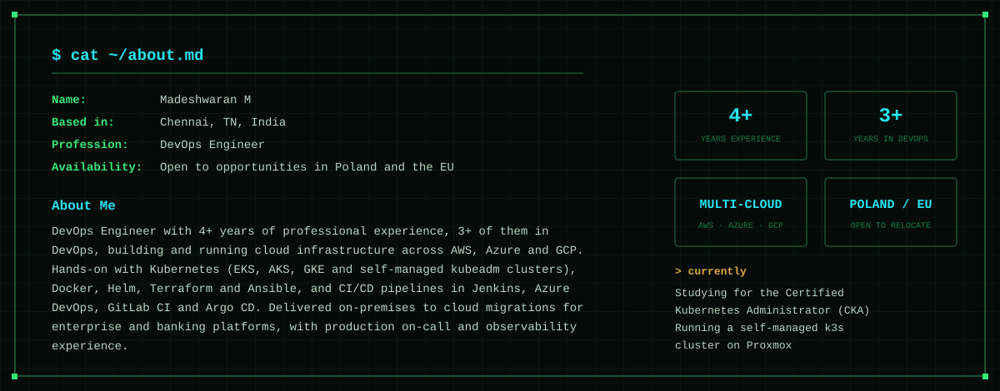
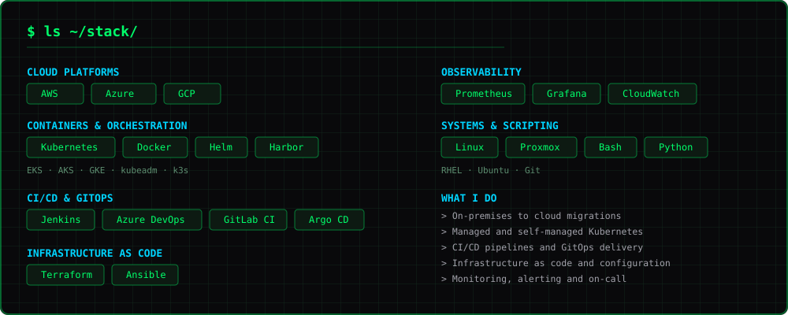

<p align="center">
  
</p>

<p align="center">
  <a href="https://www.madesh.online"></a>
  &nbsp;
  <a href="https://www.linkedin.com/in/madesh-waran-m"></a>
  &nbsp;
  <a href="mailto:madeshwaran.manikam@gmail.com"></a>
</p>

<br>

<p align="center">
  
</p>

<br>

<p align="center">
  
</p>

<br>

<h3 align="center"><code>$ ls ~/projects/</code></h3>

<p align="center">
  <a href="https://github.com/Madesh25/terraform"></a>
  <br><br>
  <a href="https://github.com/Madesh25/homelab"></a>
  <br><br>
  <a href="https://github.com/Madesh25/website"></a>
</p>

<br>

<h3 align="center"><code>$ cat ~/now.txt</code></h3>

```
> Studying for the Certified Kubernetes Administrator (CKA) exam
> Running a self-managed k3s cluster on Proxmox to test deployments and pipelines
> Writing up homelab and platform notes at www.madesh.online
```

<p align="center">
  <sub>Chennai, India · UTC+05:30 · Open to relocation</sub>
</p>
