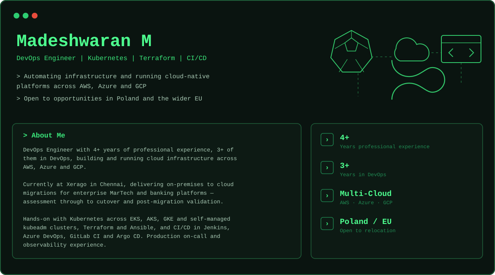

<p align="center">
  
</p>

<p align="center">
  <a href="https://www.madesh.online"></a>
  &nbsp;
  <a href="https://www.linkedin.com/in/madesh-waran-m"></a>
  &nbsp;
  <a href="mailto:madeshwaran.manikam@gmail.com"></a>
</p>

<br>

<h3 align="center"><code>$ ls ~/stack/</code></h3>

<p align="center">
  <a href="https://skillicons.dev"></a>
  <br><br>
  <a href="https://skillicons.dev"></a>
</p>

```diff
+ also   Helm · Harbor · Argo CD · kubeadm · k3s · Proxmox · Bash
+ data   Oracle · PostgreSQL · MySQL · MS SQL
```

<h3 align="center"><code>$ cat ~/now.txt</code></h3>

```diff
+ Studying for the Certified Kubernetes Administrator (CKA) exam
+ Running a self-managed k3s cluster on Proxmox to test deployments and pipelines
+ Writing up homelab and platform notes at www.madesh.online
```

<p align="center">
  <sub>Chennai, India · UTC+05:30 · Open to relocation</sub>
</p>
