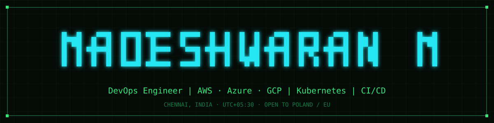

<p align="center">
  
</p>

<p align="center">
  <a href="https://www.madesh.online"></a>
  &nbsp;
  <a href="https://www.linkedin.com/in/madesh-waran-m"></a>
  &nbsp;
  <a href="mailto:madeshwaran.manikam@gmail.com"></a>
</p>

---

## `$ cat ~/about.md`

DevOps Engineer with **4+ years of professional experience, 3+ in DevOps**, building and running cloud infrastructure on AWS, Azure and GCP.

Currently at **Xerago** in Chennai, delivering on-premises to cloud migrations for enterprise MarTech and banking platforms — assessment through to cutover and post-migration validation.

🇵🇱 **Open to opportunities in Poland and the wider EU.**

---

## `$ ls ~/stack/`

**Cloud Platforms**


**Containers & Orchestration**


<sub>EKS · AKS · GKE · kubeadm · k3s</sub>

**CI/CD & GitOps**


**Infrastructure as Code**


**Observability**


**Systems & Scripting**


---

## `$ cat ~/what-i-do.txt`

```
> Migrate enterprise platforms from on-premises to containerised cloud environments
> Design and operate Kubernetes clusters — managed (EKS, AKS, GKE) and self-managed (kubeadm, k3s)
> Build CI/CD pipelines and GitOps delivery with Jenkins, Azure DevOps, GitLab CI and Argo CD
> Provision infrastructure as code with Terraform, configure it with Ansible
> Run centralised monitoring and alerting with Prometheus, Grafana and CloudWatch
> Handle production on-call, incident triage and root cause analysis
```

---

## `$ ls ~/projects/`

| Project | What it is | Stack |
|---|---|---|
| [**homelab**](https://github.com/Madesh25/homelab) | Self-hosted lab on Proxmox running a k3s cluster, ingress, storage and a monitoring stack | `Proxmox` `k3s` `Docker` `Helm` |
| [**terraform**](https://github.com/Madesh25/terraform) | Terraform modules and configurations for provisioning cloud infrastructure | `Terraform` `AWS` `GCP` |
| [**kubernetes**](https://github.com/Madesh25/kubernetes) | Kubernetes manifests, Helm charts and cluster configuration | `Kubernetes` `Helm` |
| [**portfolio**](https://github.com/Madesh25/portfolio) | Personal site at www.madesh.online — static, JSON-driven, deployed on Cloudflare Pages | `HTML` `CSS` `JS` `Cloudflare` |

---

## `$ cat ~/now.txt`

```
> Studying for the Certified Kubernetes Administrator (CKA) exam
> Running a self-managed k3s cluster on Proxmox to test deployments and pipelines
> Writing up homelab and platform notes at www.madesh.online
```

---

<p align="center">
  <sub>Chennai, India · UTC+05:30 · Open to relocation</sub>
</p>
